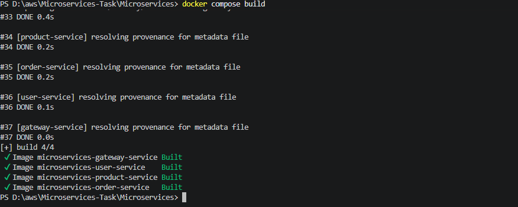
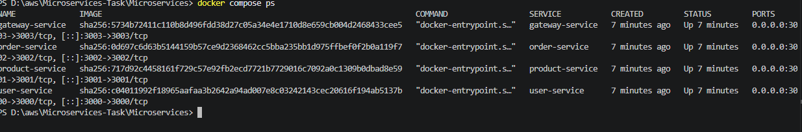
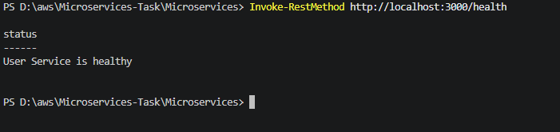
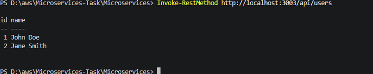
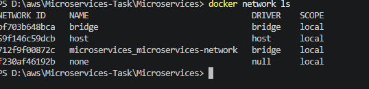

# Microservices Containerization Assessment
Repository

GitHub Repository:
https://github.com/karan11619/Microservices-Task

## Overview

This project demonstrates the containerization and orchestration of a Node.js-based microservices application using **Docker** and **Docker Compose**.

The application consists of four independent services:

* **User Service** - Port `3000`
* **Product Service** - Port `3001`
* **Order Service** - Port `3002`
* **Gateway Service** - Port `3003`

The Gateway Service communicates with the other microservices through a shared Docker network.

---

## Technology Stack

* Node.js
* Express.js
* Axios
* Docker
* Docker Compose

---

## Project Structure

```text
Microservices/
├── user-service/
│   ├── Dockerfile
│   ├── app.js
│   └── package.json
│
├── product-service/
│   ├── Dockerfile
│   ├── app.js
│   └── package.json
│
├── order-service/
│   ├── Dockerfile
│   ├── app.js
│   └── package.json
│
├── gateway-service/
│   ├── Dockerfile
│   ├── app.js
│   └── package.json
│
├── docker-compose.yml
└── README.md
```

---

## Docker Configuration

Each service has its own Dockerfile.

The Dockerfiles:

1. Use `node:20-alpine` as the base image.
2. Set `/app` as the working directory.
3. Copy the Node.js package files.
4. Install the required dependencies.
5. Copy the application source code.
6. Expose the required service port.
7. Start the application using `node app.js`.

---

## Prerequisites

Make sure the following are installed:

* Docker Desktop
* Git
* PowerShell or another terminal

Verify Docker installation:

```bash
docker --version
docker compose version
```

---

## Build the Docker Images

Navigate to the `Microservices` directory:

```bash
cd Microservices
```

Build all services:

```bash
docker compose build
```

---

## Start the Application

Start all services in detached mode:

```bash
docker compose up -d
```

Check the running containers:

```bash
docker compose ps
```

Expected services:

| Service         | Port | Status  |
| --------------- | ---: | ------- |
| User Service    | 3000 | Running |
| Product Service | 3001 | Running |
| Order Service   | 3002 | Running |
| Gateway Service | 3003 | Running |

---

## Service Testing

### User Service

Health check:

```text
http://localhost:3000/health
```

Get users:

```text
http://localhost:3000/users
```

##
## Screenshots

### Docker Images Build



### All Containers Running



### Service Health Checks



### Gateway Communication



### Docker Network

